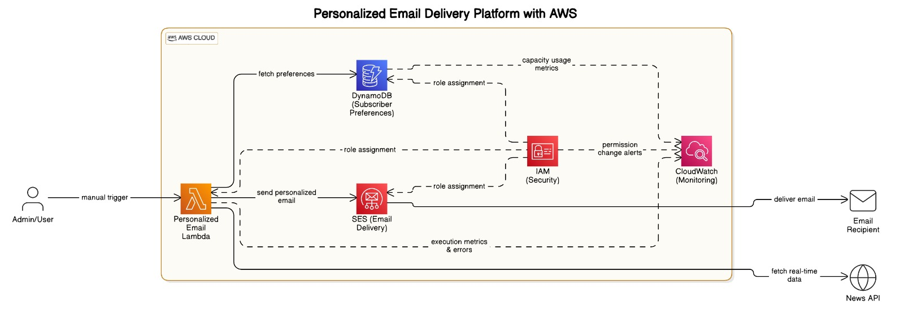

# Serverless Email Automation using AWS

This project implements a serverless solution to automate personalized email delivery using AWS cloud services. It integrates AWS Lambda, SES, DynamoDB, CloudWatch, and IAM to send templated newsletter emails tailored to individual user preferences.

## Features

- Sends personalized emails using AWS SES templates  
- Dynamic content populated with real-time data from external APIs  
- Subscriber preferences stored and managed in DynamoDB  
- Secure execution via IAM roles  
- Monitoring and logging through AWS CloudWatch  

## Technologies Used

- **AWS Lambda**: Executes the core logic for email personalization and delivery  
- **Amazon SES**: Sends emails using predefined templates with dynamic placeholders  
- **Amazon DynamoDB**: Stores subscriber preferences and user data  
- **Amazon CloudWatch**: Monitors performance and logs Lambda executions  
- **AWS IAM**: Manages fine-grained access control for services  

## Architecture Overview

This project follows a serverless architecture to ensure scalability, cost-efficiency, and minimal operational overhead. The system retrieves user preferences from DynamoDB, fetches real-time content from an external API (NewsAPI), then injects this data into an SES template for personalized email delivery.

## Architecture Diagram

## Workflow Summary

1. **Trigger**: Lambda is triggered either manually or on a schedule.  
2. **Data Retrieval**: Lambda reads subscriber preferences from DynamoDB.  
3. **Optional API Call**: External data (e.g., weather, sports, news) is fetched in real time.  
4. **Templating**: Data is inserted into SES email templates using dynamic fields.  
5. **Email Delivery**: SES sends personalized emails to subscribers.  
6. **Monitoring**: Execution logs and metrics are recorded in CloudWatch.  
